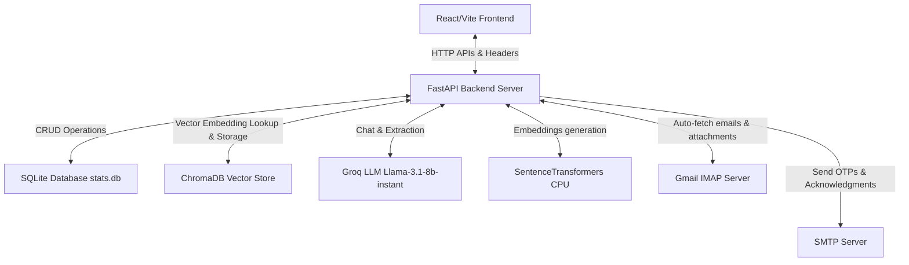
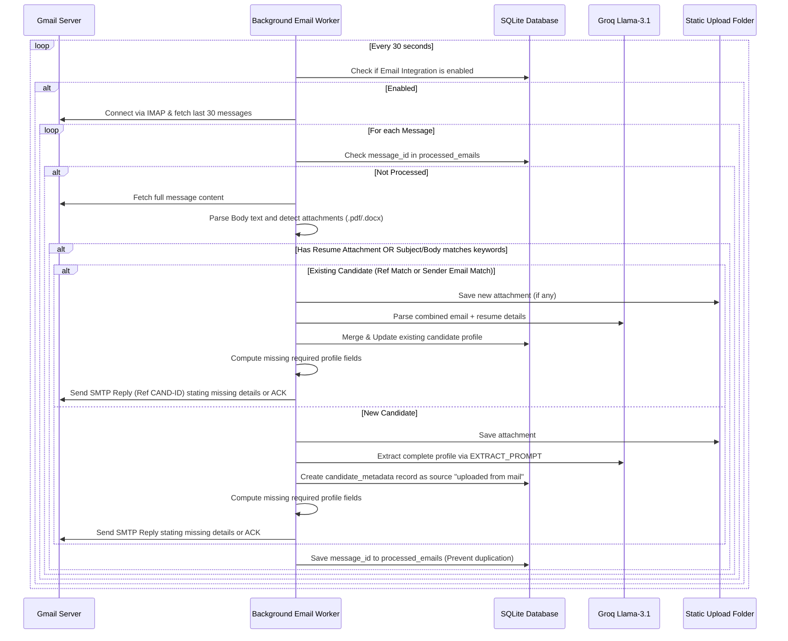

# Hire AI - Application Documentation

Welcome to the comprehensive technical documentation for **Hire AI**, a state-of-the-art recruitment assistant designed for **Alamaticz Solutions**. This application uses AI models and databases to automate candidate profile extraction, resume parsing, job matching, candidate queries via chat, email updates, and dynamic database customization.

---

## 1. System Architecture Overview

Hire AI is designed as a unified full-stack application. It can be run in two modes:
1. **Unified Production Mode (`run.bat`)**: The frontend is built into static assets, and the FastAPI backend serves these assets directly from port `8000`.
2. **Development Split Mode (`start.bat`)**: The backend runs on port `8000`, while the Vite React development server runs on port `5173`.

---

## 2. Database Design & Storage

Hire AI uses a hybrid database setup to manage data:
*   **Relational Storage**: Handles structured metadata, user access controls, audit logs, custom fields, recruiter matrix, and email tracking.
    *   **Local Development**: Powered by an embedded **SQLite** database (`stats.db`).
    *   **Cloud Hosting**: Integrates with a hosted **PostgreSQL** server. The application dynamically routes SQL queries to the remote database if credentials are configured in the environment.
*   **Vector Storage (ChromaDB)**: Stores chunked textual content of resumes to enable semantic, context-aware queries (RAG).

### 2.1 SQLite Schema & Table Details
The SQLite database (`stats.db`) initializes and self-migrates using the `init_db()` function in the backend. It consists of the following **11 tables**:

#### 1. `candidate_metadata`
Stores the extracted and manual details of candidates. It supports dynamic custom columns.
*   `id` (INTEGER PRIMARY KEY AUTOINCREMENT)
*   `filename` (TEXT): Name of the resume file on disk
*   `full_name` (TEXT): Candidate's name
*   `candidate_status` (TEXT): Default `'New'` (can transition to `In-Review`, `Available`, etc.)
*   `total_experience` (REAL): Total professional experience in years
*   `pega_experience` (REAL): Pega experience in years
*   `cdh_exp` (REAL): CDH experience in years
*   `skills` (TEXT): Comma-separated list of skills
*   `certifications` (TEXT): Comma-separated list of certifications
*   `ctc` (TEXT): Current CTC / Salary package
*   `expected_ctc` (TEXT): Expected CTC
*   `percentage_hike` (TEXT): Calculated or input percentage hike
*   `notice_period` (TEXT): Notice period in days
*   `availability_in_days` (INTEGER): Days until candidate is available
*   `current_organization` (TEXT): Most recent employer
*   `current_client` (TEXT): Client company, if applicable
*   `email` (TEXT): Candidate's email
*   `phone` (TEXT): Candidate's phone number
*   `linkedin` (TEXT): Link to LinkedIn profile
*   `current_location` (TEXT): Location currently residing in
*   `pref_locations` (TEXT): Preferred job locations
*   `domain` (TEXT): Functional industry domain
*   `tier` (TEXT): Educational or corporate Tier (Tier 1, Tier 2, Tier 3)
*   `certification_version` (TEXT): Pega certification versions
*   `email_message` (TEXT): Body of the email from which the profile was imported
*   `formatted_json` (TEXT): Cached AI-formatted resume in JSON string
*   `sender_email` (TEXT): Email address of the email sender
*   `is_qualified` (INTEGER): Default `0` (automatically set to `1` if matched to any active job)
*   `is_approved` (INTEGER): Default `1` (access control approval status)
*   `created_by` (TEXT): The username who added the candidate
*   `timestamp` (DATETIME): Default current timestamp

#### 2. `jobs`
Stores Job Descriptions (JDs) posted by recruiters.
*   `id` (INTEGER PRIMARY KEY AUTOINCREMENT)
*   `title` (TEXT NOT NULL): Job title
*   `description` (TEXT NOT NULL): Detailed description
*   `client_name` (TEXT): Client hiring for
*   `contact_name` (TEXT): Contact person at the client
*   `client_phone` (TEXT): Phone number of client contact
*   `account_manager` (TEXT): Assigned account manager
*   `assigned_recruiter` (TEXT): Recruiter handling the job
*   `target_date` (TEXT): Target date for closure
*   `job_type` (TEXT): Full-Time, Contract, etc.
*   `job_status` (TEXT): Active, Closed, Draft
*   `work_experience` (TEXT): Required work experience
*   `industry` (TEXT): Targeted industry vertical
*   `salary` (TEXT): Compensation details
*   `required_skills` (TEXT): Mandatory skills
*   `created_by` (TEXT): Recruiter who created the job
*   `created_at` (DATETIME): Timestamp when posted

#### 3. `job_candidates`
Map table representing candidate-to-job matching status and AI evaluation reasons.
*   `job_id` (INTEGER, Foreign Key referencing `jobs(id)`)
*   `candidate_id` (INTEGER, Foreign Key referencing `candidate_metadata(id)`)
*   `ai_reason` (TEXT): AI-generated explanation of suitability or recruiter notes
*   `status` (TEXT): Status of candidate in the job lifecycle (`'matched'` or `'selected'`)
*   *Primary Key*: (`job_id`, `candidate_id`)

#### 4. `users`
Contains the details of recruiters, administrators, and external stakeholders.
*   `id` (INTEGER PRIMARY KEY AUTOINCREMENT)
*   `full_name` (TEXT NOT NULL)
*   `username` (TEXT UNIQUE NOT NULL)
*   `password` (TEXT NOT NULL)
*   `email` (TEXT)
*   `role` (TEXT): Default `'user'`
*   `is_hr` (INTEGER): Default `0` (HR privilege flag)
*   `is_admin` (INTEGER): Default `0` (Admin privilege flag)
*   `is_external` (INTEGER): Default `0` (External client login flag - hides critical candidate details)
*   `hidden_fields` (TEXT): Comma-separated field names to mask for this user (e.g. `'ctc,expected_ctc'`)
*   `is_approved` (INTEGER): Default `0` (Whether account access is approved by Admin)

#### 5. `custom_columns`
Keeps track of custom columns dynamically added to the candidate database by admins.
*   `id` (INTEGER PRIMARY KEY AUTOINCREMENT)
*   `col_key` (TEXT UNIQUE): Cleaned lowercase identifier
*   `col_label` (TEXT): Human-readable column header
*   `description` (TEXT): Description/instructions for AI extraction

#### 6. `change_requests`
Audit log of pending modifications that require admin approval (e.g., user registrations, profile updates).
*   `id` (INTEGER PRIMARY KEY AUTOINCREMENT)
*   `username` (TEXT NOT NULL): Submitter
*   `action_type` (TEXT NOT NULL): Type of change (`approve_user`, `update_candidate`, etc.)
*   `target_id` (TEXT): ID of the affected resource
*   `payload` (TEXT): JSON payload with the proposed changes
*   `description` (TEXT): Summary of request
*   `status` (TEXT): Default `'pending'` (updates to `'approved'` or `'rejected'`)
*   `created_at` (DATETIME): Request timestamp

#### 7. `activity_logs`
System-wide audit trail.
*   `id` (INTEGER PRIMARY KEY AUTOINCREMENT)
*   `username` (TEXT NOT NULL): Actor
*   `action` (TEXT NOT NULL): Action performed
*   `timestamp` (DATETIME): Action timestamp

#### 8. `team_members`
A dictionary of recruiter names used for recruiter persona selection.
*   `id` (INTEGER PRIMARY KEY AUTOINCREMENT)
*   `name` (TEXT UNIQUE NOT NULL)
*   `created_at` (DATETIME)

#### 9. `job_shares`
Stores permissions for external clients to view shared job descriptions and matched candidates.
*   `job_id` (INTEGER, Foreign Key referencing `jobs(id)`)
*   `username` (TEXT, Foreign Key referencing `users(username)`)
*   *Primary Key*: (`job_id`, `username`)

#### 10. `masked_keywords`
Stores keywords (e.g., `CSSA`, `LSA`) to mask (hide with `****`) in fields for non-admin and non-HR users.
*   `keyword` (TEXT PRIMARY KEY)

#### 11. `integrations_settings`
Saves credentials and settings for Gmail connection.
*   `id` (INTEGER PRIMARY KEY AUTOINCREMENT)
*   `email_enabled` (INTEGER): `1` to enable fetching, `0` to disable
*   `imap_host` (TEXT): Default `'imap.gmail.com'`
*   `imap_port` (INTEGER): Default `993`
*   `smtp_host` (TEXT): Default `'smtp.gmail.com'`
*   `smtp_port` (INTEGER): Default `587`
*   `email_user` (TEXT): Email address
*   `email_pass` (TEXT): Password (or Gmail App Password)
*   `keywords` (TEXT): Comma-separated trigger keywords (e.g. `'resume,job'`)
*   `drive_enabled` (INTEGER): `0` or `1`

#### 12. `processed_emails`
Prevents duplicate ingestion by tracking message unique identifiers.
*   `msg_uid` (TEXT PRIMARY KEY): Gmail Message-ID or hashed header token
*   `processed_at` (DATETIME): Timestamp when processed

---

## 3. Email Ingestion & Processing Flow

Hire AI includes a background thread worker that polls a Gmail inbox, parses emails/attachments, extracts information, and follows up with applicants.

### 3.1 Verification & Ingestion Detail
1.  **Ref ID Parsing**: The worker inspects the email subject line for the regex `Ref:\s*CAND-(\d+)`. If found, the incoming content is mapped directly to that existing candidate.
2.  **Sender Email Matching**: If no Ref ID is present, the worker queries the database to see if `sender_email` matches any existing record's email or sender address.
3.  **Dynamic Ingestion & Merging**: If an email updates an existing record, the system updates fields that were previously empty or numerical 0, preserving existing non-empty values. It then invalidates the formatted resume cache by setting `formatted_json = NULL` to force recalculation.
4.  **Auto-Acknowledgment / Missing Fields Email**:
    After extraction, the system audits the candidate's fields. If any of the following fields are empty or 0, they are listed as missing:
    *   Total experience
    *   Relevant experience (Pega/CDH)
    *   Current & Expected CTC
    *   Notice period
    *   Current location & Preferred locations
    *   LinkedIn URL
    
    If fields are missing, the worker sends an automated SMTP reply requesting the missing details. If everything is complete, it sends a successful application acknowledgment.

---

## 4. Frontend Architecture & Features

The frontend is a single-page application built with **React** and **Vite**, styled with custom utility CSS in `index.css`.

### 4.1 Routing & Navigation (`App.jsx`)
Protected client-side routing is handled via `react-router-dom`:
*   `/login`: Renders the registration/login page. Supports password verification (requires at least 1 digit) and integration with **Firebase Auth** or native database check.
*   `/` (Dashboard): Renders the main candidate table.
*   `/jobs`: Accessible to HR, Admin, and External Clients. Allows JD creation, evaluation, matching, status modification, and client sharing.
*   `/upload`: Renders the drag-and-drop resume upload (single profile) or Excel sheet imports (bulk ingestion).
*   `/chat`: Core recruitment chatbot interface.
*   `/admin`: Restricted to Admin users. Manage users, approve register requests, customize custom fields, mask keywords, and edit email integration settings.

### 4.2 Core Features & Components
*   **Theming**: Dynamic toggle between Light and Dark themes stored in `localStorage` and synchronized via `document.documentElement` attributes.
*   **Recruiter Persona Matrix**: Users can change their "Active Recruiter Persona" (Boopathi, Praveen, Harish, Sabari) from the header, which automatically updates the REST request header `x-user-username` to alter database ownership scopes.
*   **Data Masking**: Non-admin and non-HR users have sensitive fields (like CTC or Certifications) masked. Custom strings are substituted with `[HIDDEN]` or mapped against the `masked_keywords` SQLite table (which masks terms like `CSSA` or `LSA` to `****`).
*   **Excel Exporter (`excelUtils.js`)**: Exports candidates lists to custom-styled `.xlsx` spreadsheets using `exceljs`. It embeds cell validation dropdowns (`New`, `In-Review`, `Available`, etc.) in the spreadsheet cells so recruiters can update statuses directly.
*   **Job Description Auto-Fill Upload Box**: An interactive dashed drop/upload container inside the Create JD form that allows recruiters to parse PDF/Word job descriptions to populate form fields instantly.
*   **A4 Resume Preview & PDF Exporter**: Provides a high-fidelity two-column A4 sheet layout (Left Panel: Education, Certifications, Technical Skills, Recognitions; Right Panel: Profile Summary, Domain Skills, Work Experience). It utilizes a strict millimeter-based height evaluation and text-chunking engine to flow content correctly across pages, solving blank page inserts and ensuring experiences like the `FORD` job bullets are not cut off.

---

## 5. Backend API & Processing Engine

The backend API is built on **FastAPI** and uses asynchronous worker pools (`BackgroundTasks`) to prevent requests from blocking during long operations.

### 5.1 Asynchronous Background Tasks
To prevent thread blockages during heavy file conversions or external API requests, FastAPI routes delegate execution to background threads:
*   `process_resume`: Processes files in background, locks threads (`_processing_lock`) to prevent memory overload, converts PDF/Docx to text, invokes Groq for extraction, writes to SQLite, indices into ChromaDB, and runs JD matching.
*   `process_excel_file`: Handles spreadsheets, parses columns matching candidate keys, saves new records, updates duplicates, and runs JD matching.

### 5.2 JD Matching Logic (`match_candidates_for_job`)
Evaluates candidates against a job description "pin to pin" using ChatGroq. To prevent hitting Groq's token limits (6000 TPM limit) when the candidate list is large, the system automatically evaluates candidates in sequential **batches of 25**.

It adheres to strict technical criteria:
1.  **Experience Matching**: If a JD requires "X+ years", candidate matches if experience $\ge$ X.
2.  **Certification Acronyms**: Automatically maps equivalent abbreviations:
    *   `CSSA` = PEGA Certified Senior System Architect
    *   `CSA` = PEGA Certified System Architect
    *   `LSA` = PEGA Certified Lead System Architect
3.  **Location Matching**: The candidate matches if their `current_location` or any of their `pref_locations` aligns with the job location.

### 5.3 Chat Processing & RAG Pipeline
The `/api/chat` endpoint routes queries dynamically across three paths:
1.  **Route 1: Conversational**: Identifies general chit-chat (e.g. "hello", "who are you") and responds directly.
2.  **Route 2: Structured (SQLite Query)**: Uses the LLM to convert the question into search parameters (e.g., `min_pega_exp`, `current_location`). It queries SQLite and returns the results as a styled React Table or count answer.
3.  **Route 3: Unstructured (RAG)**: If Route 2 returns no matches, it performs a vector similarity search on ChromaDB, fetches matching document chunks, and synthesizes a context-aware answer from the text.

### 5.4 Job Description (JD) Auto-Fill Document Parser
The `/api/jobs/parse-document` endpoint processes uploaded PDF and Word (.docx/.doc) files to extract structured information for new job creation:
1.  **Temporary Storage**: Saves the file temporarily on disk during parsing.
2.  **Text Extraction**: Extracts content using `SafePyMuPDFLoader` or `Docx2txtLoader`.
3.  **Information Extraction Prompt**: Feeds the text to `llama-3.1-8b-instant` on Groq with instructions to map values into the exact JSON schema matching job specifications (Job Title, client name, contact details, experience requirements, salary, skills, and full description).
4.  **Auto-fill Mapping**: Cleans files from the disk and sends structural JSON back to the frontend to populate the UI form fields dynamically.

---

## 6. Library & Dependency Inventory

### 6.1 Backend Dependencies (`backend/requirements.txt`)
*   `fastapi` & `uvicorn`: Web framework and ASGI web server.
*   `psycopg2-binary`: Driver for connecting to the remote PostgreSQL database.
*   `langchain` & `langchain-community`: Core framework orchestrating LLM prompt routing and data loader connections.
*   `langchain-groq`: Connector for Groq Cloud API (`llama-3.1-8b-instant`).
*   `langchain-chroma`: Wrapper managing vectors in Chroma DB.
*   `langchain-huggingface` & `sentence-transformers`: Local text embedding generator (`sentence-transformers/all-MiniLM-L6-v2`) running on CPU.
*   `torch` (CPU): Underlying tensor framework for embedding models.
*   `pymupdf` (fitz) & `docx2txt`: Extractors parsing textual data from PDF and Word files.
*   `openpyxl`: Ingests and processes bulk Excel sheets uploaded by recruiters.
*   `python-dotenv`: Environment variable config.
*   `python-multipart`: Encodes form data for file uploads.

### 6.2 Frontend Dependencies (`frontend/package.json`)
*   `react` & `react-dom` (v18.3): Framework core.
*   `vite` & `@vitejs/plugin-react`: Hot-reloading bundler and server.
*   `axios`: HTTP client communicating with backend ports.
*   `react-router-dom`: Browser routing.
*   `lucide-react`: SVG icon library.
*   `react-dropzone`: Drag-and-drop file upload.
*   `react-markdown`: Renders AI markdown outputs inside chatbot panels.
*   `recharts`: Displays graphs, statistics, and recruitment metrics.
*   `exceljs` & `xlsx` (SheetJS): Browser utilities creating spreadsheets with dropdown validations.
*   `firebase`: Syncs client session authentication state with firebase accounts.

---
*Document compiled for Alamaticz Solutions Recruitment Operations.*
