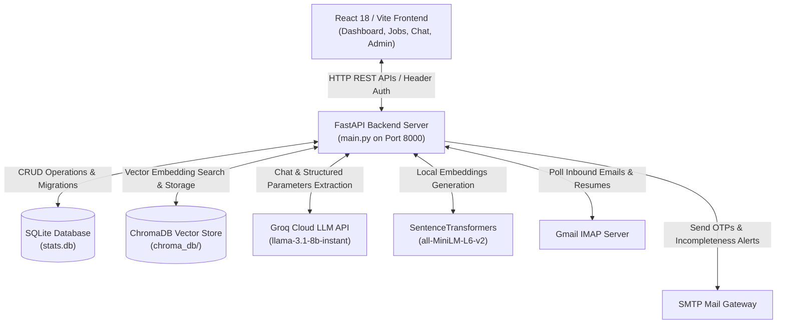
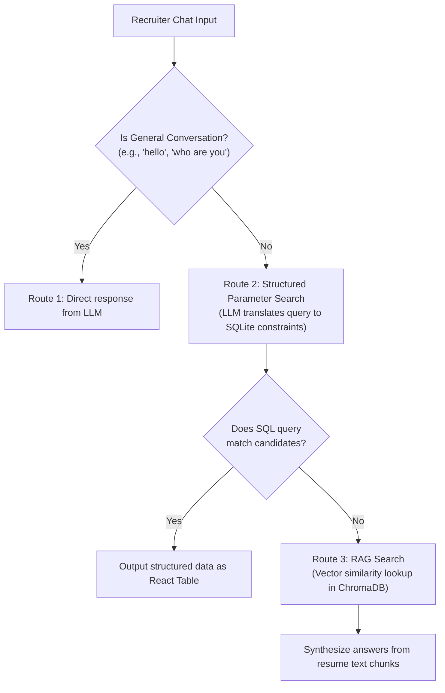
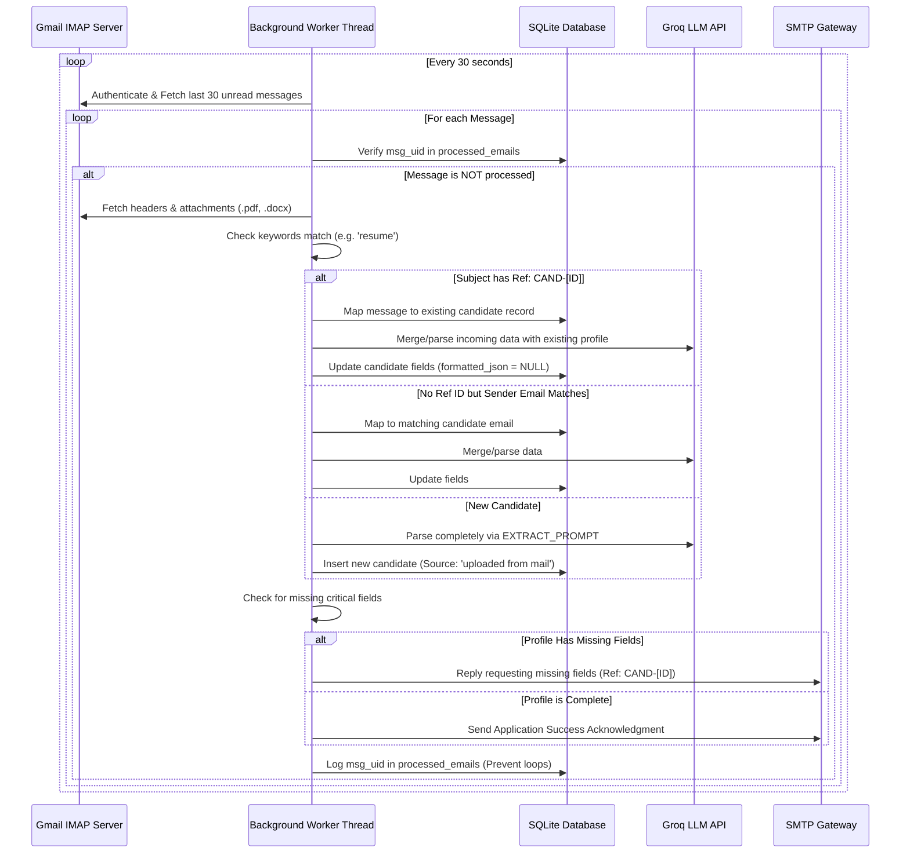

# Hire AI - Complete System Architecture & Documentation

Welcome to the comprehensive, developer-ready system documentation for **Hire AI**, a next-generation AI-powered recruitment assistant developed for **Alamaticz Solutions**. 

This documentation covers everything from the database schemas, ingestion pipelines, backend processing engines, and machine learning components to the routing, components, and user interfaces of the frontend.

---

## 1. System Overview & Architecture

**Hire AI** is a unified full-stack application built to automate candidates profile extraction, resume ingestion, job matching, recruiter-client coordination, and dynamic resume search through natural language processing (RAG).

The system operates on a client-server model and can be executed in two distinct configurations:
1. **Unified Production Mode ([run.bat](file:///c:/Users/sekhe/Downloads/Hire-Ai-main%20%281%29/Hire-Ai-main/run.bat))**: The frontend is built into static assets inside `frontend/dist`. The FastAPI backend serves these static files directly from the root route on port `8000`.
2. **Development Split Mode ([start.bat](file:///c:/Users/sekhe/Downloads/Hire-Ai-main%20%281%29/Hire-Ai-main/start.bat))**: The frontend runs on a Vite React development server at `http://localhost:5173`, proxying backend calls to the FastAPI backend running at `http://localhost:8000`.

### High-Level Architecture Diagram

---

## 2. Database Layer: Relational & Vector Storage

Hire AI uses a hybrid storage setup designed to provide both high-speed relational queries and semantic, context-aware resume searching:
*   **Relational Storage (SQLite)**: Houses structural records, user permissions, audit trails, and system configuration.
*   **Vector Storage (ChromaDB)**: Houses embedded text fragments from uploaded resumes to facilitate Retrieval-Augmented Generation (RAG) and semantic similarity lookups.

### 2.1 SQLite Schema Details (`stats.db`)
The relational database initializes automatically via `init_db()` in [main.py](file:///c:/Users/sekhe/Downloads/Hire-Ai-main%20%281%29/Hire-Ai-main/backend/main.py#L197-L469). It handles dynamic migrations to append columns automatically if they are missing. The schema consists of the following **12 tables**:

| Table Name | Purpose | Key Attributes & Fields |
| :--- | :--- | :--- |
| **`candidate_metadata`** | Core applicant profiles with support for dynamic custom fields. | `id` (PK), `filename`, `full_name`, `candidate_status` (Default: 'New'), `total_experience`, `pega_experience`, `cdh_exp`, `skills`, `certifications` *(masked for standard users)*, `ctc`, `expected_ctc`, `percentage_hike`, `notice_period`, `availability_in_days`, `current_organization`, `current_client`, `email`, `phone`, `linkedin`, `current_location`, `pref_locations`, `domain`, `tier`, `certification_version`, `email_message`, `formatted_json` *(cached extracted resume)*, `sender_email`, `is_qualified`, `is_approved`, `created_by`, `timestamp`. |
| **`jobs`** | Detailed recruiter Job Descriptions (JDs). | `id` (PK), `title`, `description`, `client_name`, `contact_name`, `client_phone`, `account_manager`, `assigned_recruiter`, `target_date`, `job_type`, `job_status` (Active, Closed, Draft), `work_experience` (required range), `industry`, `salary`, `required_skills`, `created_by`, `created_at`. |
| **`job_candidates`** | Junction table mapping candidate matches to specific jobs. | `job_id` (FK), `candidate_id` (FK), `ai_reason` *(AI match reasoning)*, `status` ('matched' or 'selected'). *Composite Primary Key*: (`job_id`, `candidate_id`). |
| **`users`** | Recruiter, Admin, and External Client access credentials. | `id` (PK), `full_name`, `username` (Unique), `password` *(native or "firebase_auth_managed")*, `email`, `role`, `is_hr` (flag), `is_admin` (flag), `is_external` (flag - hides contact/CTC info), `hidden_fields` (comma-separated names of columns to mask), `is_approved` (0/1). |
| **`custom_columns`** | Metadata of dynamic columns added to the database by admins. | `id` (PK), `col_key` (sanitized lowercase field name), `col_label` (human header), `description` (prompt instructions for AI parsing). |
| **`change_requests`** | Recruiter edit logs and sign-up requests awaiting Admin approval. | `id` (PK), `username` (sender), `action_type` (e.g., 'approve_user', 'update_candidate'), `target_id`, `payload` (JSON change values), `description`, `status` ('pending', 'approved', 'rejected'), `created_at`. |
| **`activity_logs`** | Central system-wide audit feed. | `id` (PK), `username` (actor), `action` (message description), `timestamp`. |
| **`team_members`** | Recruiter name dictionary used to drive the Active Recruiter Matrix. | `id` (PK), `name` (Unique), `created_at`. |
| **`job_shares`** | Mapping permissions for sharing client-facing job portals. | `job_id` (FK), `username` (FK). *Composite Primary Key*: (`job_id`, `username`). |
| **`masked_keywords`** | Keywords flagged to mask (replaced with `****` for standard users). | `keyword` (PK) *(e.g., 'CSSA', 'LSA')*. |
| **`integrations_settings`** | Gmail connection settings, host configurations, and passwords. | `id` (PK), `email_enabled` (0/1), `imap_host`, `imap_port`, `smtp_host`, `smtp_port`, `email_user`, `email_pass` (app credentials), `keywords` (trigger terms), `drive_enabled`. |
| **`processed_emails`** | Unique Gmail message-ID hashes to prevent duplicate file ingestion. | `msg_uid` (PK), `processed_at`. |

### 2.2 ChromaDB Integration
*   **Path**: `backend/chroma_db/`
*   **Embeddings Model**: `sentence-transformers/all-MiniLM-L6-v2` (loaded locally via HuggingFaceEmbeddings to run efficiently on CPU without requiring API subscriptions).
*   **Storage Strategy**: When a resume is successfully processed, its extracted text is chunked into recursive blocks using LangChain's `RecursiveCharacterTextSplitter`. These blocks are embedded and written into the Chroma database. The metadata for each document links directly back to the physical candidate `filename`, facilitating similarity lookups during search and RAG chains.

---

## 3. Backend Processing Engine & API Layer

Built on **FastAPI**, the backend acts as the orchestrator of all data ingestion, model processing, and security checks. It relies on standard threading locks and background queues to handle heavy workloads asynchronously.

### 3.1 Asynchronous Background Pipelines
Processing large PDF/Word files and parsing them with external LLMs is computationally expensive. FastAPI routes leverage standard `BackgroundTasks` to offload processing:
1.  **Resume Processor (`process_resume`)**: 
    - Obtains a system-wide processing lock (`_processing_lock`) to prevent concurrent processes from overloading CPU memory.
    - Calls **PyMuPDF** (`fitz`) for PDF text extraction or **Docx2txt** for Word documents.
    - Invokes Groq API to extract structured fields according to the schema (and custom columns defined in the SQLite table).
    - Saves metadata into `candidate_metadata` and chunks/embeds the content into ChromaDB.
    - Executes the automated **JD Matching** routine against all jobs.
2.  **Bulk Excel Ingestor (`process_excel_file`)**:
    - Parses Excel uploads using `openpyxl`.
    - Sanitizes phone numbers (`normalize_phone`) and email addresses (`normalize_email`).
    - Compares names (`is_similar_name`) and phone numbers (`phones_match`) against existing entries to perform automatic merges/updates instead of creating duplicate records.

### 3.2 Chat & Natural Language Query Router (`/api/chat`)
The chatbot endpoint dynamically routes user messages through a three-stage intelligent pipeline:

1.  **Route 1 (Chit-Chat)**: Direct conversation routing for general inquiries.
2.  **Route 2 (Structured SQL Search)**: The LLM analyzes the user prompt and generates a structured JSON parameters map (e.g. `{"min_pega_exp": 5, "current_location": "Chennai"}`). The backend executes this matching filter against the SQLite database, returning results as an interactive table.
3.  **Route 3 (RAG Fallback)**: If Route 2 returns empty, the query is embedded and matched via cosine similarity inside ChromaDB. The top 6 document fragments are retrieved and injected as context into the prompt, allowing specific answers to questions like: *"Which projects did candidate X complete using CDH?"*

### 3.3 Pin-to-Pin Job Description Matching
When matching resumes to active JDs, the system uses a dual-engine filter:
1.  **Hard Criteria (SQLite Level)**:
    - **Experience**: The candidate must have experience $\ge$ required experience.
    - **Certifications**: Automatically resolves acronym synonyms using dictionary lookups (e.g., maps `CSSA` to `Certified Senior System Architect`, `LSA` to `Certified Lead System Architect`, and `CSA` to `Certified System Architect`).
    - **Location**: Compares the candidate's `current_location` and `pref_locations` against the job's targeted cities.
2.  **Soft Evaluation (LLM Level)**:
    - Candidate profiles are fed into `llama-3.1-8b-instant` sequentially.
    - **Rate Limit Safeguard**: Groq limits free tier requests to 6,000 Tokens Per Minute (TPM). The backend implements **sequential batch processing (batches of 25 candidates)** and includes sleep buffers to prevent rate limit exceptions (HTTP 429).
    - Returns structured matching reasons and fit scores stored in `job_candidates`.

### 3.4 Job Description Auto-Fill Parser
The `/api/jobs/parse-document` endpoint:
- Accepts PDF/Word files representing raw JDs.
- Uses PyMuPDF or Docx2txt to pull raw text.
- Formulates a system prompt forcing the LLM to map the raw text into structured JSON fields (Client Name, Salary Range, Work Experience, Required Skills, and Target Date).
- Sends the JSON object to the frontend to automatically pre-populate the Create JD forms.

---

## 4. Frontend Architecture & Features

The frontend is a fast, responsive Single Page Application (SPA) built using **React 18** and **Vite** and configured via [App.jsx](file:///c:/Users/sekhe/Downloads/Hire-Ai-main%20%281%29/Hire-Ai-main/frontend/src/App.jsx). 

### 4.1 UI Layout & Styling System
- **Styling**: Crafted with clean Vanilla CSS variables inside [index.css](file:///c:/Users/sekhe/Downloads/Hire-Ai-main%20%281%29/Hire-Ai-main/frontend/src/index.css). It implements a state-of-the-art **Glassmorphism** layout utilizing dynamic backdrops, blur overlays, and harmonized gradients.
- **Dark Mode**: Supports dynamic toggling. Transitions are animated smoothly and stored inside `localStorage` and managed by applying a `data-theme` attribute to the root HTML node.
- **Sidebar & Core layout**: Structured inside [Layout.jsx](file:///c:/Users/sekhe/Downloads/Hire-Ai-main%20%281%29/Hire-Ai-main/frontend/src/components/Layout.jsx) with responsive collapsibility and navigation highlights.

### 4.2 Critical Frontend Features
1.  **Recruiter Persona Matrix**:
    Recruiters can modify their identity (e.g., Boopathi, Praveen, Harish, Sabari) via a dropdown in the page header. This sets `active_persona` in the state. [App.jsx](file:///c:/Users/sekhe/Downloads/Hire-Ai-main%20%281%29/Hire-Ai-main/frontend/src/App.jsx#L28-L34) dynamically intercept and injects this value into the outgoing Axios REST request headers as `x-user-username`. This enforces database ownership boundaries, scoping visible entries to the active persona if the logged-in user is not an Admin or HR.
2.  **Data Masking**:
    Security bounds prevent unauthorized data viewing. Standard users cannot view `certifications` (replaced with `[HIDDEN]` at the API tier). Furthermore, keywords like `CSSA` and `LSA` are checked against the database's `masked_keywords` table and masked with `****` before rendering.
3.  **Excel Export Utility ([excelUtils.js](file:///c:/Users/sekhe/Downloads/Hire-Ai-main%20%281%29/Hire-Ai-main/frontend/src/utils/excelUtils.js))**:
    Uses the `exceljs` library to generate custom-styled spreadsheet exports. It builds column headers with customized styling and embeds **data validation dropdowns** (like `New`, `In-Review`, `Available`, `Placed`, `Rejected`) within the status cells, allowing recruiters to edit lists offline and keep status choices consistent.
4.  **Auto-Filling Form Upload Box**:
    Built into [JobsPage.jsx](file:///c:/Users/sekhe/Downloads/Hire-Ai-main%20%281%29/Hire-Ai-main/frontend/src/pages/JobsPage.jsx) using drag-and-drop dropzones. When a JD file is dropped, it fetches structural JSON from the parsing API and populates the text fields instantly.

---

## 5. Integrations & Background Workers

### 5.1 Gmail Background Ingestion Worker
The backend runs a background polling loop (`poll_emails_and_process`) that checks the IMAP mailbox every 30 seconds if `email_enabled` is active:

### 5.2 Verification & Missing Fields Audit
After extracting the candidate data, the worker evaluates if any key fields are missing or unset:
- Total Professional Experience
- Relevant Experience (Pega or CDH)
- Compensation Details (CTC, Expected CTC)
- Notice Period
- Current Location / Preferred Locations
- LinkedIn URL

If any of these fields are missing, the worker sends an automated response explaining what needs updating. Recruiters or candidates can reply directly; because the subject lines contain the custom reference tag `Ref: CAND-[ID]`, the worker maps follow-up replies back to the candidate's existing database ID to fill in missing details.

---

## 6. Project Commands & Maintenance Scripts

### 6.1 Executable Launchers
*   **Unified Production Launcher ([run.bat](file:///c:/Users/sekhe/Downloads/Hire-Ai-main%20%281%29/Hire-Ai-main/run.bat))**:
    1. Installs `.venv` and python dependencies from `backend/requirements.txt` if they do not exist.
    2. Builds the frontend using `npm run build` inside `frontend/`.
    3. Terminates any conflicting servers running on port `8000`.
    4. Automatically launches `http://localhost:8000` in the user's default web browser.
    5. Starts the FastAPI server (`python -m uvicorn backend.main:app --port 8000`).
*   **Development Launcher ([start.bat](file:///c:/Users/sekhe/Downloads/Hire-Ai-main%20%281%29/Hire-Ai-main/start.bat))**:
    1. Installs frontend `node_modules` and backend `.venv` if missing.
    2. Kills conflicting processes on ports `8000` and `5173`.
    3. Launches the backend on port `8000` and Vite dev server on port `5173` in separate command prompt consoles.
    4. Executes [wait_servers.ps1](file:///c:/Users/sekhe/Downloads/Hire-Ai-main%20%281%29/Hire-Ai-main/wait_servers.ps1) to confirm endpoints are active before launching the default browser at `http://localhost:5173`.

### 6.2 Error Cleanup Utility ([cleanup_errors.py](file:///c:/Users/sekhe/Downloads/Hire-Ai-main%20%281%29/Hire-Ai-main/backend/cleanup_errors.py))
During heavy ingestion cycles, formatting anomalies or API limits can create dummy placeholder candidate records with the name `Processing Error: [Details]`.
Running this script:
1. Queries SQLite for records where `full_name LIKE 'Processing Error:%'`.
2. Locates and deletes the physical files saved under `backend/static/`.
3. Clears associated matching rows in `job_candidates`.
4. Deletes the candidate rows in `candidate_metadata` to restore database integrity.

---

## 7. Configuration Details & Credentials
Environment configurations are managed through `.env` files in both the root folder and `backend/`. The primary environment variables are:
- `GROQ_API_KEY`: API access token for ChatGroq models.
- `STATS_DB_PATH`: Specific disk path for `stats.db` (Default: `backend/stats.db`).
- `SMTP_SENDER`: Email used to send automated acknowledgments and follow-ups.
- `SMTP_PASSWORD`: Password or App Password for SMTP connection.
- `IMAP_HOST` & `SMTP_HOST`: Gmail or custom server host settings.

*Documentation compiled for Alamaticz Solutions Recruitment Operations.*
